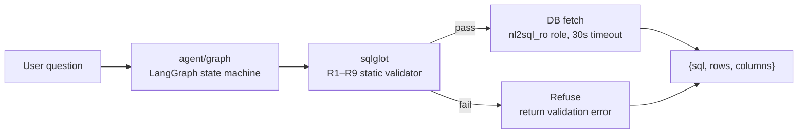
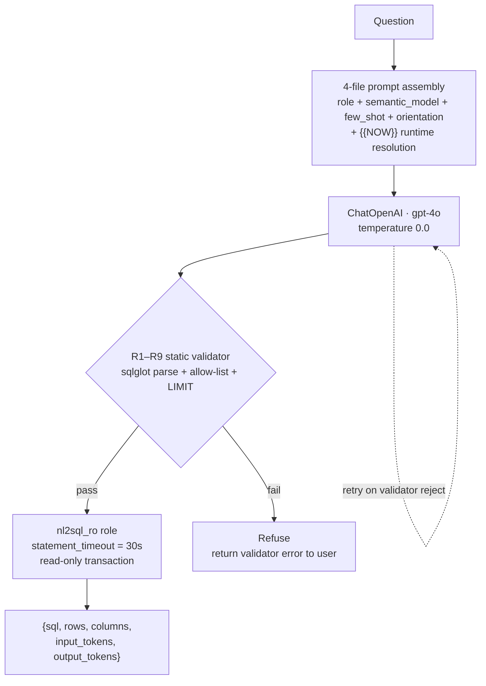

# Olist NL2SQL Agent

> A read-only LangGraph NL2SQL agent for the Olist e-commerce dataset — ask in English, get a validated SQL query and the rows back. The interesting part isn't the agent: it's the eval harness underneath it. 39 hand-curated cases, 5-dimension rubric grading, and a measured story of which prompt fixes actually moved the pass rate (53.8% → 66.7%) versus which only added cost.

## The 30-second picture



The validator is a hard gate. The LLM can suggest anything, but `INSERT`, `pg_*`, `SELECT *`, or a CTE name from a sloppy R5 patch never reaches the database.

## Why I built this

I wanted to know whether eval-driven prompt iteration actually beats hand-tuning, and the answer turned out to be: *yes, but only if you measure honestly*. The first version of the prompt had a CTE bug I'd been quietly masking by writing more rules. The 39-case eval harness caught it in a single run. That's the whole project.

## The data

9 Olist CSVs → 10 tables in the validator (9 raw + 1 derived `geolocation_by_zip` materialized view; raw `geolocation` is the R6 trap, blocked by design). CC BY-NC-SA 4.0 (non-commercial) — [Kaggle](https://www.kaggle.com/datasets/olistbr/brazilian-ecommerce). ~100k orders, 2016–2018. Known quirks documented in the failure stories (`docs/failure/`).

## The solution



`{{NOW}}` is substituted at request time from `dataset_max_date` so the few-shot examples stay anchored as time advances.

## The 4-file prompt system

| File | Role |
|---|---|
| `agent/prompts/role.md` | Static role + 8 hard rules. Kept short after FS-015 showed that rules the model doesn't follow just add cost. |
| `agent/prompts/semantic_model.yaml` | Metrics, dimensions, synonyms. Has `{{NOW}}` for date-anchored metric values. |
| `agent/prompts/few_shot.yaml` | 15 worked examples. Each one is a real failure mode from the eval set. |
| `agent/prompts/orientation.md` | Data gotchas — grain traps, percentage denominators, pre-aggregation patterns. |

## SQL safety: R1–R9 static validator

The validator is independent of the LLM — deterministic, side-effect-free, tested by 54 unit tests in `tests/unit/test_validator.py`. Defense in depth: read-only DB role + `statement_timeout = 30s` are the second and third walls.

| Rule | Check | Action |
|---|---|---|
| R1 | `sqlglot` parse succeeds | **Block** on parse error |
| R2 | Top-level must be `SELECT` or `WITH … SELECT` | **Block** |
| R3 | No DDL/DML keywords (`INSERT`, `UPDATE`, `DELETE`, `DROP`, `ALTER`, `CREATE`, `TRUNCATE`, `GRANT`, `REVOKE`, `COPY`, `VACUUM`, `REINDEX`) | **Block** |
| R4 | No system catalogs (`pg_*`, `information_schema`) | **Block** |
| R5 | Only allowed tables (10 in the allow-list) | **Block** |
| R6 | Raw `geolocation` is a trap — use `geolocation_by_zip` | **Block** |
| R7 | No `SELECT *` — list every column | **Block** |
| R8 | Non-aggregating queries get an auto-injected `LIMIT 1000` | **Inject** |
| R9 | `INNER JOIN product_category_translation` warns (silent NULL drop) | **Warn** |

## Secrets

`.gitleaks.toml` + `scripts/ci/install-hooks.sh` install a pre-commit hook. After `brew install gitleaks && ./scripts/ci/install-hooks.sh`, every `git commit` runs `gitleaks protect --staged --redact`. Real keys are blocked; placeholders in `.env.example` and the docs are allowlisted via `regexTarget = "match"`. One-off history audit: `gitleaks detect --source . --no-banner`.

## Evals

### Pass rate by difficulty (v3, gpt-4o-mini, 39 cases)

```
Easy   🟩🟩🟩🟩🟩🟩🟩🟩🟩🟩🟩🟩🟩🟥🟥🟥     13/16  (81.3%)
Medium 🟩🟩🟩🟩🟩🟩🟩🟩🟩🟥🟥🟥🟥             9/13  (69.2%)
Hard   🟩🟩🟩🟩🟥🟥🟥🟥🟥🟥                   4/10  (40.0%)
─────────────────────────────────────────────────────
All    🟩🟩🟩🟩🟩🟩🟩🟩🟩🟩🟩🟩🟩🟩🟩🟩🟩🟩🟩🟩🟩🟩🟩🟩🟩🟥🟥🟥🟥🟥🟥🟥🟥🟥🟥🟥🟥   26/39  (66.7%)
```

### v1 → v2 → v3 — what moved the needle

| Run | Prompt | Cases | Pass rate | Cost/case | Notes |
|---|---|---|---|---|---|
| `third_eval_run_20260724_195212` | v1 (baseline) | 39 | 21/39 (53.8%) | $0.011 | CTE bug masked by hand-tuning |
| `failure_run_with_promptv2_20260724_220750` | v2 (+ 1,015 tokens of "SQL style rules") | 18 (subset) | 5/18 (27.8%) | $0.015 | **Apples-to-oranges subset. Same 13 cases in both runs: 0/13. Regressions in 3 new cases (FS-009/010/011).** |
| `20260724_215741` (now `evals/results/baseline/`) | v3 (surgical patch on v2: trim noisy rules, add 3 examples) | 39 | **26/39 (66.7%)** | $0.012 | +12.9 pp honest gain. New passes: e06, h07, m09. |

**Honest read:** Prompt v2 was a wash. The big visible "fix" (the CTE bug, FS-001) was actually a one-line validator patch — not a model improvement. v3 trims the noise and adds targeted examples. Receipts in `evals/apply_prompt_v2.md` and `evals/apply_prompt_v3.md`.

### The 5 rubric dimensions

Each case is graded on five dimensions, plus execution match (EX):

| Dimension | What it checks |
|---|---|
| `table` | Are the FROM-clause tables the ones the question needs? |
| `time_frame` | Is the date/period filter correct (any of `EXTRACT`, `DATE_PART`, `TO_CHAR`, `STRFTIME` accepted)? |
| `filters` | Are the WHERE-clause predicates semantically right (column + value), not text-exact? |
| `aggregation` | Is the aggregate function + grain correct? |
| `join` | Are the joins the ones needed? |

**EM (exact match) is always 0%** in NL2SQL — no predicted SQL is byte-identical to gold. **EX** is the meaningful signal. For context on the broader NL2SQL benchmark space, see [Spider 2.0](https://spider2-sql.github.io/).

### What's in the repo

- **`evals/cases.yaml`** — 39-case source of truth
- **`evals/golden_set/`** — original CSV before conversion
- **`evals/results/baseline/`** — v3 reference run (26/39); the one canonical result set kept in the repo, other run dirs are gitignored
- **`evals/scripts/`** — `eval_runner.py` (parallel runner with checkpointing), `rubric.py` (sqlglot-based grader), `report_generator.py`
- **`evals/tests/eval_runner_test/`** — unit tests for the runner, rubric, checkpoint manager, and report generator

## Failure stories — the 5 most-impactful

Full set in `docs/failure/`. The short version:

| Story | What broke | Fix lever | Cases recovered |
|---|---|---|---|
| **FS-001** | R5 allow-list rejected CTE names as "unknown tables" | Validator patch: subtract CTE names from FROM refs | 4 |
| **FS-002** | Rubric flagged `EXTRACT(field FROM x)` as wrong when gold used `DATE_PART`/`TO_CHAR` | Rubric: accept all 4 time-function forms | 4 |
| **FS-003** | Agent over-filtered with `WHERE order_status='delivered'`; dropped `+ freight_value` (~14% undercount) | Prompt: "no scope creep" + revenue rule | 3 |
| **FS-009** | v2 prompt's "how many" pattern didn't generalize without trigger words | Ex12 added (no-trigger-word variant) | 1 |
| **FS-015** | v2 added 1,015 tokens of "SQL style rules" the model didn't follow | Trim to 3 rules that demonstrably work | cost only |

## Quick start

```bash
git clone https://github.com/Riishi-Development/text2sql.git
cd text2sql
uv sync

cp .env.example .env
# Edit .env: set OPENAI_API_KEY, LANGSMITH_API_KEY

# Start PostgreSQL on port 5432 (Docker, Homebrew, or system package)
# Download Olist CSVs from Kaggle and place them at data/Olist Dataset/
# (CC BY-NC-SA 4.0 — not bundled with this repo)

uv run python scripts/db/setup_db.py   # creates nl2sql_ro role + materialized view

uv run python -m agent "Top 5 categories by late-delivery rate, with at least 50 orders"

# Or via the FastAPI server
uv run uvicorn api.app:app --reload
```

Run the eval suite (after the DB is up):

```bash
uv run python evals/scripts/eval_runner.py                       # full 39 cases
uv run python evals/scripts/eval_runner.py --difficulty hard     # just the 10 hard cases
uv run python evals/scripts/eval_runner.py --resume              # resume an interrupted run
```

## Layout

```
text2sql/
├── agent/                      # NL2SQL agent
│   ├── graph.py                # LangGraph state machine: generate → validate → execute
│   ├── main.py                 # CLI entry point
│   ├── db/                     # read-only psycopg connection
│   ├── prompts/                # 4-file prompt assembly
│   ├── schema/                 # DB metadata loader
│   └── validator/              # R1–R9 static SQL safety checks (sqlglot)
├── api/                        # FastAPI: GET /health, POST /query
├── core/                       # pydantic settings, env loading
├── tests/                      # pytest: unit, integration, e2e
│   ├── unit/test_validator.py  # 54 R1–R9 tests
│   ├── integration/            # require live PostgreSQL
│   └── e2e/                    # require running FastAPI server
├── evals/                      # the 39-case eval suite
│   ├── cases.yaml              #   39 cases: id, difficulty, gold_sql, expected, rubric
│   ├── golden_set/             #   original CSV before conversion
│   ├── scripts/                #   runner, rubric grader, report generator
│   ├── tests/eval_runner_test/ #   unit tests for the eval harness
│   ├── apply_prompt_v2.md      #   prompt-iteration postmortem
│   ├── apply_prompt_v3.md      #   prompt-iteration postmortem
│   ├── openai_model_comparison.md
│   └── results/baseline/       #   the v3 reference run (26/39, 66.7%)
├── scripts/db/                 # init_db.sql, setup_db.py, setup-docker.sh
├── docs/
│   └── failure/                # FS-001..015 postmortems
├── .gitleaks.toml
├── pyproject.toml
└── .env.example
```

## What I'd do differently

Run the eval before adding prompt rules, not after. Track cost per fix alongside pass-rate delta — v2's +40% token cost and 0/13 apples-to-apples is the receipt for why this matters.

## License

MIT for the code. The Olist dataset (not bundled) is **CC BY-NC-SA 4.0** (non-commercial) — see [Kaggle](https://www.kaggle.com/datasets/olistbr/brazilian-ecommerce).
